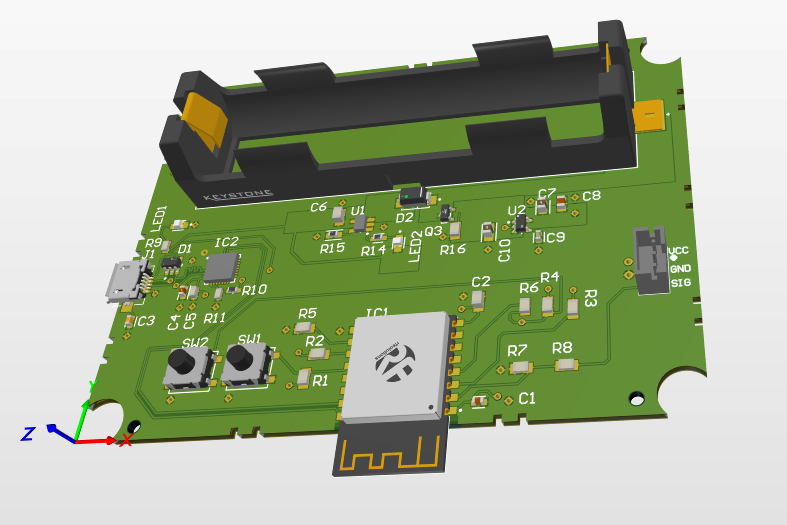

# SoilMonitor_PCB
Custom PCB for a smart soil moisture monitoring system using ESP-12S and external sensor integration. 
The system is powered by a rechargeable 18650 battery and features Wi-Fi connectivity for real-time data transmission.

## 🌿 Project Overview

This project was developed as part of a university course in PCB design.  
It combines embedded control, wireless communication, power management, and environmental sensing in a compact 4-layer board.

## 🔧 Key Features

- **ESP-12S microcontroller** (based on ESP8266 with Wi-Fi)
- **SparkFun Soil Moisture Sensor** input (SIG, VCC, GND)
- **18650 Li-ion battery** support with **LTC4054 charger**
- **MIC5219 LDO** for 3.3V regulated output
- **USB input** with ESD protection and charging indication
- **CP2102** for USB-to-UART programming and serial communication
- Fully routed in **Altium Designer**, 4-layer PCB (Top, GND, VCC, Bottom)
- Designed to fit inside a **Deltron 479-0160-1** waterproof enclosure

## ⚡ Applications

- Smart agriculture
- Soil monitoring stations
- Remote irrigation automation
- IoT-based environmental sensing

## 📂 Project Files

- `*.PrjPcb` – Main Altium project file
- `*.SchDoc` – Schematic files (divided into subsystems)
- `*.PcbDoc` – PCB layout
- `*.OutJob`, `*.Draftsman` – Output & documentation
- `README.md` – Project overview (this file)
- `LICENSE` – MIT License

## 📦 Downloadable ZIP Package

For convenience, the entire Altium project, including schematics, PCB layout, Gerber files, and BOM, is available as a ZIP package:
[📥 Download SoilMonitor_PCB.zip](./SoilMonitor_PCB.zip)

## 👨‍💻 Author

**Naor David**
Electronics Engineer
